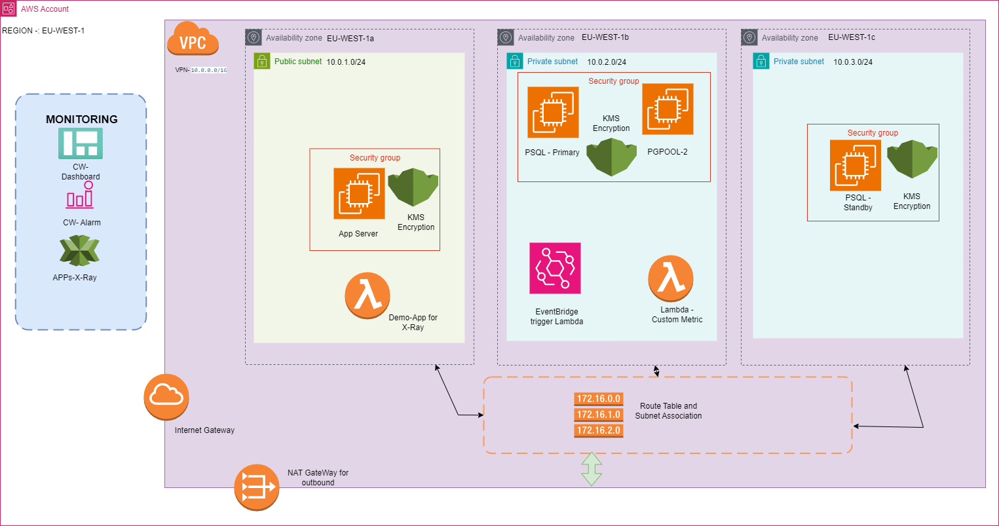

# Senior AWS Database Engineer Assessment
## Introduction
This repository contains Terraform and python code created for the interview emailed on 11-APR-2024. Assessment details and solution approaches are summarized below
## Assessment To Be Completed
Keeping aligned to best practice referenced within AWS Well Architected Framework, please build a secure, fault tolerant, elastic database infrastructure that can serve a transactional application.   Use of IAC is encouraged but not mandatory.

Application function would need at minimum a Relational database, persistent Storage, Web presentation layer and optionally a caching mechanism that can speed up transactional throughput.
 
The most significant part of the objective would be the Database layer - its ability to sustain high load via scalability/load balancing and seamlessly perform failover and failback via automation.  In an event a node is taken out of operation due to failure or standard maintenance task such as vulnerability patching, the cluster operation needs to be able to promptly elect a new master or re-add a failed one back as slave. Not use of AWS native RDS PostgreSQL or RDS Aurora is not encouraged - intent is to assess your skillset and thought process resolving objectives by putting building blocks from scratch. 

No problem borrowing ideas from already existing GitHub posted projects which reflect the same requirement.

For the purpose of the assignment, please use PostgreSQL 15 or 16, deployed on EC2 instances. Use Linux operating system of your choice - Amazon Linux 2023 AARCH64 is preferred, but fine you go for Ubuntu for example.    

Application can be as simple as writing a value to Database in a transaction block and reading the same.

It's of paramount importance monitoring of infrastructure and application /in the context of DB function/ is handled effectively.  Please use CloudWatch metrics and an observability tool of your preference /Grafana, etc/.  Consider use of AWS X-Ray to provide application transactional tracing capability and timing of each component. Use custom SQL based metrics that report on application function /e.g. number of transactions last 10 minutes/.

Lastly, please document your assignment & produce a diagram on infra buildout / application data flow.

Additional notes:
- Alarms are good to have but focus is building a robust fault tolerant and scalable Database cluster, based on PostgreSQL built on EC2 systems
- Comprehensive Logging at DB layer that enables query, plan and PostgreSQL system components monitoring and supports a fast incident analysis
- Use of a tool that analyzes DB log records over 24-hour period and reports on the same is desired
- Out of the box thinking when addressing challenges is a top scorer on this test, and not quantity of items built 
- Documentation should not be anything excessive 1-2 pages at most
## Architecture Diagram

## Architecture Priciple 
- Use AWS well architected framework  
- Use Terraform for deployment 
- Use Python programming language for application and custom metric creation 
- Not to use RDS 
- Use Postgres15 

## Details of Implementation 
- Isolate complete applciation using VPC/subnet 
- Postgres on EC2 for both primary and standby 
- Installed PGPOOL2 for database load balancer , failover and failback 
- AWS lambda is used for custom SQL based metric aalrm and display in dahsboard 
- CloudWatch Dashboard is used as observability tool 
- CloudWatch Metrics samples are used to showcase the monitoring
- Applciation extensive observability used AWS X-Raay service 
- A sample Python application is used make use of ElasticCache 

